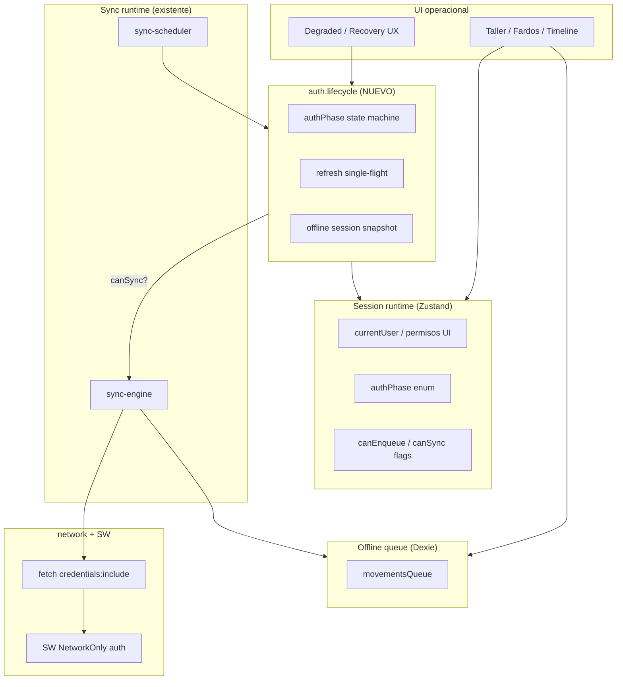
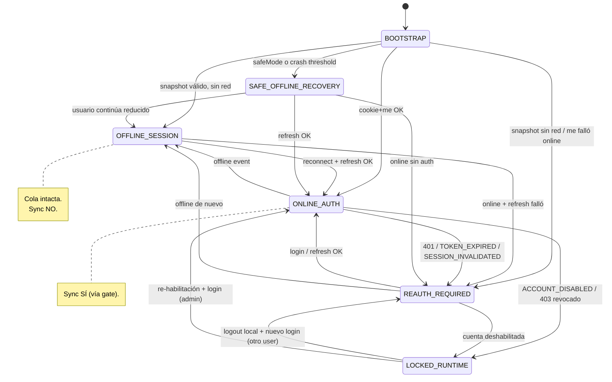
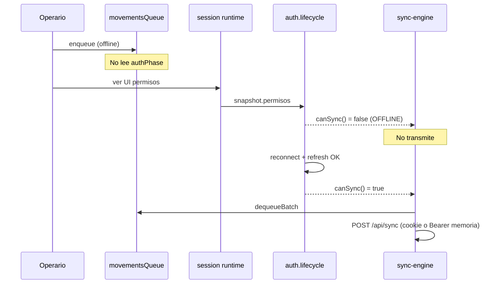
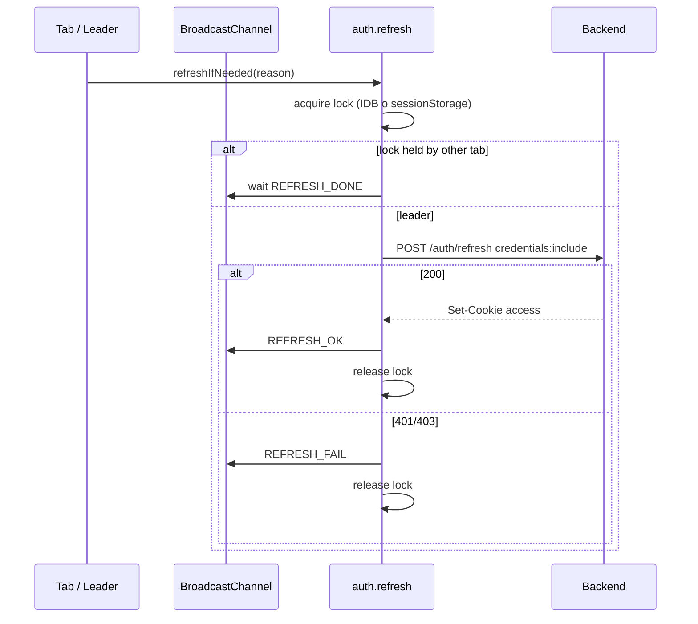
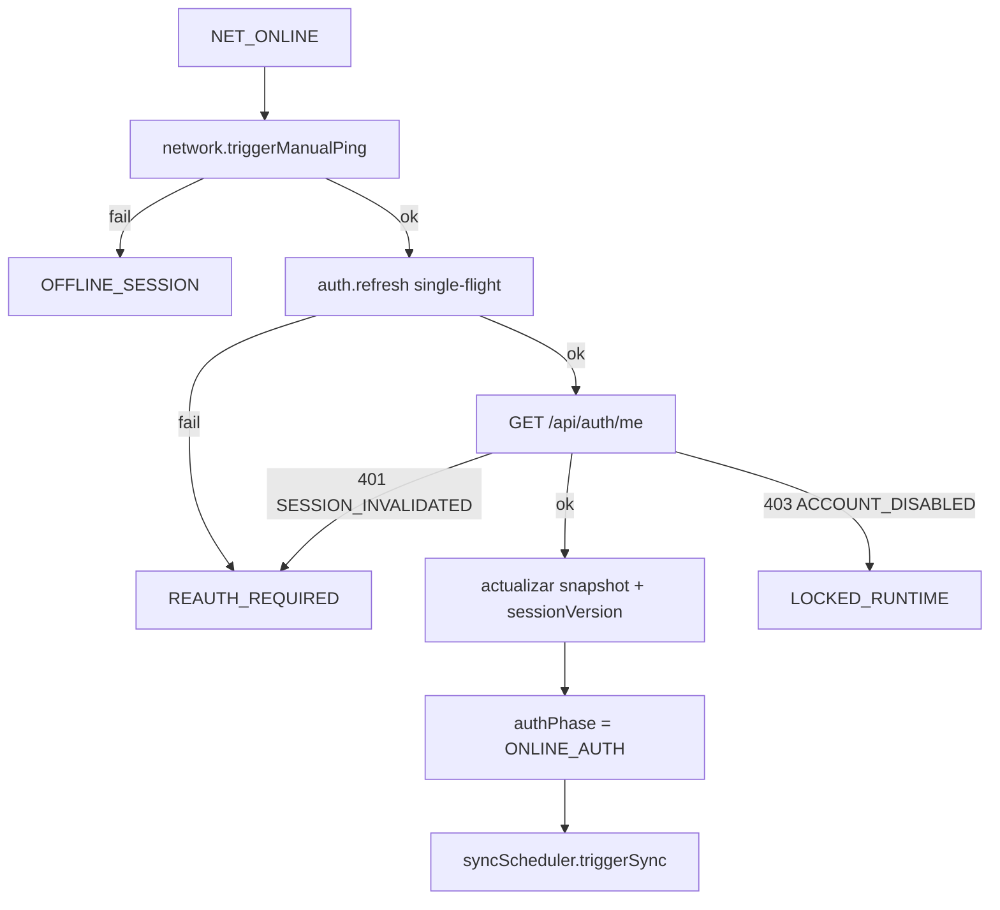

# Fase 8B — Auth Runtime & Sesión Operacional Offline-First

**Estado:** diseño aprobado para implementación (sin código aún).  
**Reemplaza / extiende:** `docs/RUNTIME_AUTH_DEBT.md`  
**Principio rector:** continuidad operacional > auth enterprise genérico.

---

## 0. Situación actual (baseline)

| Capa | Hoy | Riesgo |
|------|-----|--------|
| Backend login | Cookie `httpOnly` **y** `token` en JSON | Doble superficie; cliente persiste JSON |
| JWT | 7 días, mismo token cookie + Bearer | No es “access corto”; refresh inexistente |
| Cliente | `jwt_token` + `current_user` en `systemConfig` (Dexie) | Credencial larga en IDB; SW no la cachea pero sync la lee |
| Sync | `sync-engine` → Bearer desde IDB | **Race** con expiración / revocación |
| Boot | `checkSession()` restaura user si hay IDB | Sync puede despertar sin revalidar |
| Revocación | `sessionVersion` en JWT + DB | **Existe** en backend; cliente no reacciona de forma unificada |

El SW ya usa `NetworkOnly` en `/api/auth/*` — correcto, mantener.

---

## 1. Arquitectura Auth Runtime (separación de concerns)



### Reglas inmutables

1. **La cola (`movementsQueue`) nunca se borra** por logout, expiración JWT, revocación ni refresh fallido.
2. **Enqueue offline** depende de `OfflineSessionSnapshot` + permisos mínimos, **no** del access token.
3. **Sync** depende de `auth.lifecycle.canSync()` === true (sesión online validada).
4. **Access token** solo en memoria del tab (módulo closure); nunca en Dexie tras 8B.
5. **Cookie httpOnly** es el único refresh carrier en cliente (no legible por JS).

---

## 2. Auth Lifecycle — estados y transiciones

### 2.1 Estados (`AuthPhase`)

| Estado | Significado operativo |
|--------|----------------------|
| `ONLINE_AUTH` | Red OK + sesión validada (`/me` o refresh OK). Sync permitido. |
| `OFFLINE_SESSION` | Sin red (o red no verificada); snapshot local; enqueue OK; sync pausado. |
| `REAUTH_REQUIRED` | Hay red pero sesión inválida/expirada; enqueue OK; sync bloqueado; UI recovery. |
| `LOCKED_RUNTIME` | Cuenta deshabilitada / sesión revocada (`sessionVersion`); enqueue puede limitarse por permiso; sync bloqueado. |
| `SAFE_OFFLINE_RECOVERY` | Boot tras crash/safe mode con snapshot dudoso; operación local mínima hasta reauth. |

> `LOCKED_RUNTIME` ≠ borrar datos. Es **modo operativo restringido** + pantalla de re-login.

### 2.2 Diagrama de estados



### 2.3 Eventos que disparan transición

| Evento | Fuente | Transición típica |
|--------|--------|-------------------|
| `NET_OFFLINE` | `network.service` | → `OFFLINE_SESSION` |
| `NET_ONLINE` | network + auth | → refresh pipeline (no sync directo) |
| `REFRESH_OK` | `auth.refresh` | → `ONLINE_AUTH` |
| `REFRESH_FAIL` | 401/403 | → `REAUTH_REQUIRED` o `LOCKED_RUNTIME` |
| `ME_OK` / `ME_FAIL` | `/api/auth/me` | validación permisos + `sessionVersion` |
| `LOGOUT_LOCAL` | usuario | → `REAUTH_REQUIRED`; snapshot borrado |
| `LOGOUT_REMOTE` | cookie cleared | → `REAUTH_REQUIRED` |
| `SESSION_REVOKED` | `SESSION_INVALIDATED` | → `REAUTH_REQUIRED` |
| `ACCOUNT_DISABLED` | 403 | → `LOCKED_RUNTIME` |
| `BOOT_SAFE` | `safeModeEngine` | → `SAFE_OFFLINE_RECOVERY` |

---

## 3. Runtime Session vs Sync vs Queue



### Contratos

**Session runtime (Zustand)** — ampliar store existente, sin store paralela:

```typescript
type AuthPhase =
  | "ONLINE_AUTH"
  | "OFFLINE_SESSION"
  | "REAUTH_REQUIRED"
  | "LOCKED_RUNTIME"
  | "SAFE_OFFLINE_RECOVERY";

// Flags derivados (selectors), no duplicar lógica en UI
canEnqueue(): boolean  // snapshot presente && !LOCKED (o policy)
canSync(): boolean     // authPhase === ONLINE_AUTH && online
```

**Sync runtime** — cambio mínimo en `sync-engine.processQueue()`:

```typescript
if (!authLifecycle.canSync()) return; // antes de dequeue
```

**Queue** — sin imports de `auth.service` para enqueue.

---

## 4. Offline Auth Strategy

### 4.1 Eliminar de Dexie (post-8B)

- `systemConfig.jwt_token` — **prohibido**
- Cualquier refresh token — **prohibido**

### 4.2 Persistir solo snapshot (`offline_session`)

```typescript
interface OfflineSessionSnapshot {
  userId: string;
  nombre: string;
  email: string;           // display / auditoría local
  permisos: string[];      // subset operativo ya resuelto en login
  sessionVersion: number;  // alinear con JWT payload backend
  deviceFingerprint: string; // hash estable dispositivo (no PII)
  issuedAt: string;        // ISO
  lastValidatedAt: string; // ISO — actualizado en cada /me OK
}
```

**Migración boot:** si existe `jwt_token`, usar una vez para `/me`, escribir snapshot, **borrar** `jwt_token`.

### 4.3 Access token (memoria)

```typescript
// auth.session.ts — module singleton, NO Zustand
let accessToken: string | null = null;  // opcional si API sigue Bearer
let accessExpiresAt: number | null = null;

export function getAccessToken(): string | null {
  if (accessExpiresAt && Date.now() > accessExpiresAt) return null;
  return accessToken;
}
export function clearAccessMemory(): void { ... }
```

Preferencia 8B: **API sync y REST usan `credentials: 'include'`** y dejan de enviar Bearer cuando cookie sea suficiente. Bearer en memoria solo como transición.

### 4.4 Backend token model (cambio acotado)

| Token | Duración sugerida | Transporte |
|-------|-------------------|------------|
| Access JWT | 15–60 min | Cookie `token` httpOnly (+ memoria tab si hace falta) |
| Refresh | 7–30 días | Cookie `refresh` httpOnly, path `/api/auth`, `SameSite=Lax/Strict` |

Nuevo endpoint: `POST /api/auth/refresh` → rota access cookie, valida refresh, incrementa métricas.  
`POST /api/auth/login` → **dejar de devolver `token` en body** (o marcar deprecated una versión).

---

## 5. Refresh Lifecycle



### Single-flight + anti-storm

| Mecanismo | Valor |
|-----------|--------|
| Lock key | `systemConfig.auth_refresh_lock` `{ owner, until }` o `sessionStorage` |
| Cooldown | 30s entre refresh no forzados |
| Retry budget | 3 fallos / 10 min → `REAUTH_REQUIRED` |
| Visibility | No refresh en `document.hidden` salvo `reason=reconnect` |
| Multi-tab | `BroadcastChannel('tml-auth')` — un líder, resto esperan |
| Concurrent | Promesa compartida en módulo `refreshInFlight` |

**Sync NO despierta refresh:** `sync-engine` llama `authLifecycle.ensureAuthForSync()` que encadena refresh → si falla, aborta batch (items quedan `RETRY_SCHEDULED`).

---

## 6. Reconnect Lifecycle



**Explícitamente NO:** `online` → `syncEngine.triggerSync()` directo (hoy lo hace `sync-scheduler` y `sw-client`).

**Orden boot (runtime.lifecycle):**

1. safe mode / crash recovery cola  
2. `auth.lifecycle.restoreSnapshot()`  
3. network init  
4. si online → reconnect pipeline (sin sync)  
5. `syncScheduler.init()` solo registra listeners; primer sync tras `ONLINE_AUTH`  
6. telemetry / adaptive  

---

## 7. Revocation Strategy

| Caso | HTTP | authPhase | Cola | Enqueue | Sync |
|------|------|-----------|------|---------|------|
| Token expirado | 401 `TOKEN_EXPIRED` | `REAUTH_REQUIRED` | preservada | sí* | no |
| sessionVersion mismatch | 401 `SESSION_INVALIDATED` | `REAUTH_REQUIRED` | preservada | sí* | no |
| Usuario deshabilitado | 403 `ACCOUNT_DISABLED` | `LOCKED_RUNTIME` | preservada | no** | no |
| Logout remoto | cookie cleared | `REAUTH_REQUIRED` | preservada | sí* | no |
| Refresh inválido | 401 | `REAUTH_REQUIRED` | preservada | sí* | no |

\* Enqueue permitido para no frenar depósito; movimientos quedan pendientes hasta reauth (política operativa).  
\** Opcional: permitir enqueue con banner “no se sincronizará” — recomendado **bloquear nuevos** en `LOCKED_RUNTIME`.

**Recovery UX (ya existe DegradedScreen):** añadir acciones “Re-autenticar” sin tocar cola.

---

## 8. Riesgos reales + mitigaciones

| Riesgo | Mitigación |
|--------|------------|
| SW cache auth | Ya `NetworkOnly`; auditar que `fetch` sync use `credentials: 'include'` |
| Race auth/sync | Gate `canSync()`; `ensureAuthForSync()` antes de dequeue |
| Multi-tab refresh storm | Single-flight + BroadcastChannel |
| Android PWA cookies | `SameSite=Lax`, `Secure` prod, path `/`; probar WebView depósito |
| Background SW wakeup sync sin cookie | SW solo `SYNC_WAKEUP` → cliente hace pipeline auth primero |
| Token en memoria leak | `clearAccessMemory()` en logout y `visibilitychange` tras LOCKED |
| Replay movimientos | Ya `payloadHash` + `clientGeneratedId` backend |
| Session desync tabs | `REFRESH_OK` broadcast + actualizar snapshot Dexie |
| Login body expone JWT | Eliminar token del JSON; migración |
| 7d JWT único | Separar access/refresh en backend |
| Dependencia IDB auth en enqueue | Solo snapshot |

---

## 9. Estructura de implementación (concreta)

### Frontend (`src/app/`)

```
auth/
  auth.types.ts           # AuthPhase, OfflineSessionSnapshot
  auth.session.ts         # access token en memoria
  auth.snapshot.ts        # read/write Dexie offline_session
  auth.refresh.ts         # single-flight, cooldown, broadcast
  auth.lifecycle.ts       # state machine, canSync, onReconnect
  auth.selectors.ts       # canEnqueue, canSync, selectAuthPhase

services/
  auth.service.ts         # refactor: login/logout/checkSession → lifecycle

runtime/
  runtime.lifecycle.ts    # orden boot; no sync antes de ONLINE_AUTH
  runtime.store.ts        # authPhase (+ opcional health ya existe)

sync/
  sync-engine.ts          # gate + credentials include
  sync-scheduler.ts       # online → auth.onReconnect no sync directo

network/
  network.service.ts      # online → auth.lifecycle no sync

services/
  sw-client.service.ts    # SYNC_WAKEUP → auth pipeline
  catalog.service.ts      # credentials include, sin getJWTToken IDB
```

### Backend (`src/backend/`)

```
routes/auth.routes.ts       # + POST /refresh
controllers/auth.controller.ts
services/auth.service.ts    # sign access short + refresh cookie
middleware/auth.middleware.ts # leer access cookie; refresh route separado
```

### Dexie

```
systemConfig keys:
  offline_session     # snapshot
  auth_refresh_lock   # opcional multi-tab
  # ELIMINAR jwt_token tras migración
```

### Métricas (telemetry existente)

- `auth_refresh_ok`, `auth_refresh_fail`, `auth_phase_change`
- `auth_reconnect_duration_ms`
- `sync_blocked_auth` (cuando gate impide sync)

---

## 10. Criterios de aceptación 8B

1. Cero `jwt_token` en Dexie después de migración + login nuevo.  
2. Sync con red solo tras `ONLINE_AUTH`.  
3. Cola intacta tras logout, revocación y refresh fallido.  
4. Reconnect: health → refresh → me → sync (orden verificable en logs/métricas).  
5. Una sola refresh concurrente con 2 tabs (test manual).  
6. SW no almacena respuestas `/api/auth`.  
7. Android: login + offline enqueue + reconnect sync en dispositivo real o emulador.

---

## 11. Fuera de alcance 8B

- OAuth / SSO / proveedores externos  
- RBAC dinámico en cliente más allá del snapshot  
- Rotación biométrica / PIN  
- Cifrado Dexie completo (evaluar 8C si hace falta)

---

## 12. Orden de implementación sugerido

1. `auth.types` + `auth.snapshot` + migración boot (borrar jwt_token)  
2. Backend `POST /refresh` + access corto  
3. `auth.refresh` single-flight + BroadcastChannel  
4. `auth.lifecycle` + store `authPhase`  
5. Gates sync + reconnect pipeline  
6. Ajuste `catalog.service` / fetch global `credentials: 'include'`  
7. Métricas + panel DIAG auth fields  
8. Pruebas Android + documentar en `RUNTIME_AUTH_DEBT.md` → cerrado  

---

*Documento listo para implementación. No introducir providers ni SDKs externos.*
