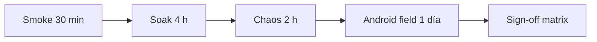

# Fase 8B Finalization — QA + Chaos + Runtime Validation

**Estado:** plan aprobado — PR1 chaos/profiling DONE — **validación E1–E5 en curso**.  
**Runbook ejecución:** [`RUNTIME_8B_VALIDATION_EXECUTION.md`](RUNTIME_8B_VALIDATION_EXECUTION.md) · plantillas en [`validation-results/`](validation-results/README.md).  
**Prerequisito:** 8B.1–8B.5 DONE.  
**Próximo hito producto:** 8C (solo tras sign-off de esta etapa).  
**Principio:** la cola (`movementsQueue`) es verdad operacional — ningún test la borra.

---

## 0. Alcance y no-alcance

### En alcance
- Validación en dispositivos Android reales (gama baja/media).
- Chaos tooling **interno**, activable solo en build dev / flag explícito.
- Profiling y detección de anomalías sobre telemetría existente (8A.8).
- Matriz de aceptación operacional antes de 8C.
- Revisión UX industrial (taller / fardos / cola / recovery).

### Fuera de alcance (esta etapa)
- Nuevos módulos auth, OAuth, stores globales, microservicios.
- Frameworks E2E enterprise (Playwright farm, BrowserStack masivo).
- CRDT / event sourcing / realtime complejo.
- Cambios de lógica de negocio o schema de cola.

---

## 1. Plan QA operacional

### 1.1 Objetivo
Demostrar que el runtime soporta **8–12 h de jornada operativa** (con interrupciones) sin:
- pérdida de movimientos locales,
- sync duplicado sistemático,
- loops auth/sync,
- degradación UX que impida operar con una mano.

### 1.2 Entornos mínimos

| Entorno | Dispositivo / SO | Red | Notas |
|---------|------------------|-----|-------|
| E1 | Android 10–12, 2–3 GB RAM | Wi‑Fi estable | Baseline |
| E2 | Mismo hardware | 3G throttled (DevTools o red real) | Latencia + battery saver |
| E3 | Android 13+ PWA standalone | Flapping manual | Reconnect chaos |
| E4 | Desktop Chrome | — | Regresión rápida + diag |
| E5 | 2 tabs misma PWA | Wi‑Fi | Multi-tab auth |

### 1.3 Roles en prueba

| Rol | Responsabilidad |
|-----|-----------------|
| Operador simulado | Flujos taller/fardos, cola, offline 30+ min |
| QA runtime | Escenarios suspend/foreground, chaos panel |
| Dev observer | `/app/diag`, export métricas, heap snapshots |

### 1.4 Fases de ejecución (orden fijo)



1. **Smoke (30 min)** — boot, login, 10 movimientos offline, sync, recovery auth.
2. **Soak (4 h)** — app abierta con pendientes; alternar foreground/background cada 15 min.
3. **Chaos (2 h)** — panel interno con escenarios acotados (sección 2).
4. **Field (1 día)** — operación real o simulada en planta con E1/E2.
5. **Sign-off** — matriz sección 7; bloqueantes = 0.

### 1.5 Artefactos por sesión de prueba

Guardar por sesión (captura o export desde diag):
- `authPhase`, `lockedReason`, `healthLevel`, `syncPending/conflicts/failed`
- Conteo `metricsLog` (Dexie)
- Últimas 20 entradas métricas críticas (`auth_*`, `sync_*`, `sw_*`)
- Screenshot header (ONLINE/OFFLINE/REAUTH/LOCKED)
- Hora inicio/fin y versión commit

### 1.6 Criterio de pausa (stop-the-line)

Detener release a 8C si ocurre **cualquiera**:
- Movimiento desaparece de cola sin `SYNCED`/`FAILED`/`CONFLICT` explicado.
- Doble envío al servidor del mismo `clientGeneratedId` (verificar auditoría backend).
- Loop: >25 `syncTriggers` en 1 min sin cola nueva (métrica `sync_loop_suspected`).
- `LOCKED_RUNTIME` sin pantalla recovery usable.
- Crash repetido (>2) en mismo flujo operativo.

---

## 2. Chaos scenarios (tooling interno)

### 2.1 Principios del harness
- Activación: `localStorage.tml_chaos=1` o query `?chaos=1` (solo dev/staging).
- Un panel en `/app/diag` — botones con **cooldown** y límites por sesión.
- Cada acción registra métrica `chaos_*` (no CRITICAL salvo abort).
- **Nunca** mutar `movementsQueue` destructivamente.

### 2.2 Escenarios a implementar (prioridad)

| ID | Simulación | Mecanismo propuesto | Qué validamos |
|----|------------|---------------------|---------------|
| C01 | 401 aleatorio en sync | Wrapper fetch en chaos layer, % configurable | Gate auth, rollback batch, cola intacta |
| C02 | Refresh fail | Mock `coordinatedRefresh` reject | LOCKED / REAUTH, no storm |
| C03 | Network flapping | `online`/`offline` sintético cada N s (max 10 ciclos) | Debounce reconnect, un pipeline |
| C04 | Latencia extrema | `fetch` delay injection 3–8 s | Sync no bloquea UI, timeouts |
| C05 | Sync abort mid-batch | AbortController en transmit | Items vuelven a PENDING/FAILED correcto |
| C06 | Dexie quota | Intentar llenar `metricsLog` hasta cap (ya 450) | Prune, no crash boot |
| C07 | Visibility storm | 20× `visibilitychange` en 10 s | Cooldown integrity 8s, no refresh storm |
| C08 | Multi-tab lock | Tab A lock, Tab B recovery | BC `RUNTIME_LOCKED` / `SESSION_RESTORED` |
| C09 | SW update durante sync | `applyPendingUpdate` forzado | Cola no corrupta, reauth si aplica |
| C10 | IndexedDB blocked | `chaos_idb_readonly` flag (simular throw en writes no-cola) | Degraded claro, enqueue local si posible |
| C11 | Memory pressure | Disparar `memory_pressure` sintético | Tier DEGRADED, timeline trim |
| C12 | Cookie expirada | Limpiar solo `tml_access` vía instrucción manual + chaos refresh | `foreground_resume`, recovery UX |

### 2.3 Límites de seguridad (anti-autodestrucción)

- Max 3 chaos activos por hora en field.
- Flapping max 10 ciclos / sesión.
- 401 injection max 30% requests sync durante 5 min.
- Auto-off chaos al detectar `healthLevel === CRITICAL'` 3 ciclos seguidos.

### 2.4 Implementación sugerida (siguiente PR)

```
src/app/chaos/
  chaos.flags.ts       # lectura flag, guards
  chaos.fetch.ts       # wrap fetch condicional
  chaos.scenarios.ts   # funciones puras por ID
  chaos.panel.tsx      # UI en DiagnosticsPanel
```

Sin dependencias nuevas. Integrar solo en build donde `import.meta.env.DEV` o env `VITE_CHAOS=1`.

---

## 3. Profiling strategy

### 3.1 Señales ya disponibles (aprovechar)

| Señal | Fuente actual | Uso en 8B fin |
|-------|---------------|---------------|
| Memoria JS ratio | `readMemoryPressureRatio()` | Trend cada 60s en diag |
| Health score | `runtime.telemetry` 60s | Anomalía automática |
| Sync triggers | `syncTriggers1m` rolling | Storm detection |
| Auth métricas | `auth_*` CRITICAL | Revoke/drift budget |
| Cola | `queueService` counts | Throughput |
| metricsLog size | `metricsService.getMetricsReport()` | Growth cap |
| Long tasks | PerformanceObserver | UI freeze |

### 3.2 Mediciones a añadir (liviano)

| Métrica | Frecuencia | Objetivo |
|---------|------------|----------|
| `runtime_heap_used_mb` | 5 min + post-sync | RAM trend |
| `observers_active_count` | 10 min | Leak listeners |
| `runtime_cleanup_disposed` | on auto-recovery | Cleanup efectivo |
| `queue_throughput_per_hour` | derivada pending→synced | Operación real |
| `metrics_log_bytes_estimate` | 15 min | Dexie growth |
| `boot_to_ready_ms` | cada cold start | Regresión arranque |

### 3.3 Timeline de sesión (manual + semi-auto)

Durante soak 4 h, muestrear cada **15 min**:

```
T+0   boot_to_ready_ms, syncPending, authPhase
T+15  heap, metricsCount, cacheEntries, healthScore
T+30  idem + conflicts/failed
...
```

Export: botón "Copiar snapshot diag" en panel (JSON clipboard).

### 3.4 Detección automática de anomalías (extender 8A.9)

Umbrales propuestos (rolling, sin ML):

| Anomalía | Condición | Acción |
|----------|-----------|--------|
| Memory creep | heap +15% en 30 min, 3 samples | `health` WARNING + log |
| Sync storm | syncTriggers1m ≥ 20 | auto-recovery existente |
| Auth loop | auth_refresh_failed ≥ 5 en 10 min | sugerir REAUTH en diag |
| Metrics bloat | metricsLog ≥ 400 persistente | force prune |
| Queue stall | pending > 0, sin lastSyncAt change 2 h online | banner diag |

### 3.5 Herramientas externas (manual, no en repo)

- Chrome Remote Debugging → Performance + Memory (1 snapshot inicio/fin soak).
- `about:memory` / DevTools Allocation sampling en Android vía USB.
- No obligatorio Lighthouse; priorizar **operación real**.

---

## 4. Runtime validation matrix

Matriz: **escenario × subsistema × resultado esperado**.

Leyenda: ✅ debe pasar | ⚠️ degradado aceptable | ❌ bloqueante

| Escenario | Auth | Sync gate | Cola | SW | UI | Telemetría |
|-----------|------|-----------|------|----|----|------------|
| Boot offline con snapshot | OFFLINE_SESSION ✅ | no sync ✅ | intacta ✅ | register ✅ | operar ✅ | snapshot_restored ✅ |
| Boot online sin token memoria | refresh→ONLINE ✅ | gate refresh ✅ | intacta ✅ | — | — | foreground_resume ✅ |
| 30 min offline + 20 encolados | OFFLINE ✅ | pausa silenciosa ✅ | 20 pending ✅ | — | feedback ✅ | no storm ✅ |
| Reconnect Wi‑Fi | 1 pipeline ✅ | sync post-auth ✅ | sin dup ✅ | — | ONLINE badge ✅ | reconnect_* ✅ |
| Tab suspend 3 h | resume refresh ✅ | no sync hasta auth ✅ | intacta ✅ | — | recovery si lock ⚠️ | integrity_check ✅ |
| 2 tabs logout tab A | tab B LOGOUT BC ✅ | sync stop ✅ | intacta ✅ | — | — | — |
| SESSION_REVOKED remoto | LOCKED ✅ | denied ✅ | intacta ✅ | — | recovery ✅ | auth_runtime_revoked ✅ |
| SW update con pending 5 | — | resume post-reload ⚠️ | 5 pending ✅ | update OK ✅ | — | sw_update_* ✅ |
| Crash browser mid-sync | recovery crash ✅ | retry ✅ | SYNCING→PENDING ✅ | — | — | — |
| Battery saver ON | DEGRADED ⚠️ | slower sync ⚠️ | intacta ✅ | ping largo ⚠️ | usable ✅ | battery_* ✅ |
| Dexie casi lleno (metrics) | — | — | cola OK ✅ | — | — | prune ✅ |
| Chaos C03 flapping | no loop ✅ | debounce ✅ | intacta ✅ | — | — | — |

---

## 5. Memory leak checklist

Revisar en cada release candidate:

### 5.1 Listeners y timers

| Componente | Registro | Cleanup | Verificación |
|------------|----------|---------|--------------|
| `network.service` | `init()` | `destroy()` | no duplicate online handlers |
| `sw-client.service` | `init()` | `destroy()` | message listener off |
| `sync-scheduler` | `init()` | `destroy()` | unsubscribe pending |
| `auth.lifecycle` visibility | `initCoordination` | — | single listener (auditar) |
| `auth.integrity` heartbeat | `start()` | `stop()` añadir si falta | interval cleared |
| `runtime.telemetry` | `start()` | `stop()` | observers disconnected |
| `IncrementalTimeline` | `registerRuntimeCleanup` | dispose on recovery | IO + subscribe |
| `DiagnosticsPanel` | interval 15s | `clearInterval` | ✅ ya existe |

### 5.2 Promesas y single-flight

- `refreshInFlight`, `reconnectInFlight`, `ensureAuthInFlight`, `checkInFlight` → deben nullificar en `finally`.
- Tras 50 ciclos reconnect: máximo **1** refresh HTTP concurrente (Network tab).

### 5.3 Dexie / caches

- `metricsLog` no crece sin techo (450 cap).
- Cache SW: sin crecimiento ilimitado en nombres fuera policy.
- Timeline: paginación keyset — no `toArray()` global en producción.

### 5.4 React

- Rutas lazy: unmount no deja subscriptions (Route boundaries).
- Zustand: evitar subscribe globales nuevos sin unsubscribe.

### 5.5 Procedimiento heap (1× por soak)

1. Heap snapshot T+0 post-boot READY.
2. Operar 1 h (encolar + sync).
3. Heap snapshot T+1h.
4. Comparar **Detached nodes** y **Array** growth; delta < 10% aceptable en PWA larga.

---

## 6. Android-specific edge cases

| Caso | Comportamiento esperado | Cómo probar |
|------|-------------------------|-------------|
| PWA standalone vs browser tab | Mismo runtime; BC puede fallar entre procesos | 2 shortcuts + fallback storage |
| Process kill (swipe away) | Boot restaura snapshot; cola Dexie persiste | Encolar → kill → reopen |
| Memory purge token | `foreground_resume` + recovery | Suspender 1h, abrir |
| Chrome battery saver | `batterySaver` + tier DEGRADED | Ajustes sistema ON |
| WebView antiguo / RAM 2GB | SAFE_MODE posible tras crashes | 3 boots fallidos simulados |
| Teclado + numeric pad | No tapar botones críticos | Taller ingreso rápido |
| Screen off 30 min | No refresh storm al encender | Power button cycle ×5 |
| Install PWA sobre versión vieja | Migración snapshot; sin jwt legacy | Actualizar build |
| SW waiting + sync activo | No perder lote SYNCING | Update durante cola |
| Split screen / resize | Layout operable | Rotate + split |
| Airplane 2 h | OFFLINE_SESSION; enqueue OK | Modo avión |
| Duplicate tab sync | Un refresh; tabs alineadas | 2 tabs trigger sync |

---

## 7. Acceptance criteria reales (sign-off 8B)

### 7.1 Bloqueantes (0 tolerancia)

- [ ] **B1** — 0 movimientos perdidos en 100 encolados (offline/online mix).
- [ ] **B2** — 0 duplicados servidor con mismo `clientGeneratedId` en chaos + soak.
- [ ] **B3** — Cola nunca borrada por auth/logout/lock/revoke.
- [ ] **B4** — Tras LOCKED, operario puede revalidar o reingresar en ≤3 taps.
- [ ] **B5** — Sin refresh storm: ≤1 POST `/refresh` por incidente reconnect.
- [ ] **B6** — Boot a READY < 8 s en E1 (red normal).
- [ ] **B7** — `healthLevel` CRITICAL no persiste >10 min sin recovery o mensaje claro.

### 7.2 Importantes (≤2 excepciones documentadas)

- [ ] **I1** — Soak 4 h: `syncPending` final ≤ inicial + encolados nuevos (neto correcto).
- [ ] **I2** — Memoria estable ±15% al final del soak.
- [ ] **I3** — Auto-recovery ≤2 veces / 4 h sin SAFE_MODE permanente.
- [ ] **I4** — Timeline usable con 500+ ítems locales (scroll sin freeze >500ms).
- [ ] **I5** — Numeric pad: registro ingreso <10 s mano única (medición 5 operadores).

### 7.3 UX operacional (revisión cualitativa)

- [ ] **U1** — Targets táctiles ≥44px en acciones primarias (taller/fardos/sync).
- [ ] **U2** — Contraste legible en sol (patio) — no solo dark mode.
- [ ] **U3** — Feedback inmediato al encolar (<100ms perceived).
- [ ] **U4** — Estado auth siempre visible (ONLINE/OFFLINE/REAUTH/LOCKED).
- [ ] **U5** — Recovery no bloquea ver historial local.

### 7.4 Sign-off

| Gate | Responsable | Fecha | OK |
|------|-------------|-------|-----|
| Smoke | | | |
| Soak | | | |
| Chaos | | | |
| Android field | | | |
| UX walkthrough | | | |
| **8B FINAL** | | | |

**Aprobación 8B FINAL** → habilita inicio 8C.

---

## 8. Operational UX validation (plan de walkthrough)

Rutas a recorrer con cronómetro y conteo de taps:

1. **Taller** — ingreso manual completo (offline → online sync).
2. **Fardos** — flujo principal feliz + error stock.
3. **Cola** — SyncDrawer: pending, retry failed, ver conflicto.
4. **Recovery** — forzar REAUTH (chaos C02) → revalidar → sync.
5. **Diag** — leer health, export snapshot.

Métricas UX (objetivo):

| Flujo | Taps objetivo | Tiempo objetivo |
|-------|---------------|-----------------|
| Ingreso taller 1 línea | ≤6 | ≤12 s |
| Ver estado cola | ≤2 | ≤3 s |
| Reauth completo | ≤5 | ≤30 s |

No cambiar estética; solo fricción, tamaño, orden de foco.

---

## 9. Orden de implementación (post-plan)

1. `chaos.*` + sección en `DiagnosticsPanel` (C01–C08 primero).
2. Métricas profiling §3.2 + export snapshot JSON.
3. `auth.integrity.stop()` + audit listeners §5.1.
4. Script manual QA checklist (markdown → issues).
5. Ejecutar matriz §4 en E1–E5.
6. Sign-off §7.

---

## 10. Referencias código actual

| Área | Archivo |
|------|---------|
| Telemetría | `src/app/telemetry/runtime.telemetry.ts` |
| Auto-recovery | `src/app/telemetry/runtime.auto-recovery.ts` |
| Diag UI | `src/app/components/runtime/DiagnosticsPanel.tsx` |
| Auth gate | `src/app/auth/auth.sync-gate.ts` |
| Integrity | `src/app/auth/auth.integrity.ts` |
| Recovery UX | `src/app/components/runtime/AuthRecoveryScreen.tsx` |
| Cleanup | `src/app/runtime/runtime.cleanup-registry.ts` |
| Política métricas | `src/app/telemetry/telemetry.policy.ts` |
